<div align="center">

# 🚀 Derived

### The Agentic Generative UI Platform

**From natural language to production-ready React apps in seconds.**

[](https://github.com/Sri-Krishna-V/Derived-WMD)
[](LICENSE)
[](https://nextjs.org)
[](https://tambo.ai)

[Features](#-core-features) • [Architecture](#-architecture) • [Getting Started](#-getting-started) • [Tambo Integration](#-how-we-used-tambo-in-derived)

</div>

---

## 🎯 About the Project

**Derived** (derived-wmd) is an AI-first **Agentic Development Environment** that goes beyond simple code generation. Unlike traditional "text-to-code" tools which guess blindly, Derived employs an autonomous **Tambo Agent** that actively explores, understands, and modifies your codebase in real-time.

By combining **Generative UI**, the **Model Context Protocol (MCP)**, and a secure **E2B Sandboxed Runtime**, Derived bridges the gap between natural language ideas and production-ready React applications. It manages the entire lifecycle—from cloning designs to implementing complex features on top of existing codebases—installing packages, fixing errors, monitoring builds, and rendering interactive progress components directly in the chat stream.

The platform excels at:

- **Zero-Shot App Creation**: "Build a CRM dashboard" → Full app in 60s.
- **Visual Cloning**: "Clone this landing page" → Firecrawl scrapes & recreates it.
- **Iterative Refinement**: "Make the header dark" → Surgical edits to existing files.
- **Self-Healing Builds**: Automatically detects errors and installs missing NPM packages.

---

## 🤖 How We Used Tambo in Derived

We didn't just want a chatbot; we wanted an Agentic IDE. We used **Tambo** to transform our interface from a passive text stream into an active, Generative UI surface.

### 1. As the Agentic Orchestrator (The Brain)

Instead of hardcoding APIs, the **Tambo Agent** autonomously decides which tools to call.

- **What it does:** When you say "Build a dashboard," the Agent analyzes intent and orchestrates a multi-step workflow on its own—scanning files, installing dependencies, and generating code—without brittle `if/else` logic.

### 2. For "Generative UI" Feedback (The Visuals)

Tambo renders **React Components** inside the chat stream, replacing spinners with rich context.

- **`BuildStatus` Component:** When `generateCode` runs, Tambo renders a live progress card showing logs (e.g., *"Installing framer-motion..."*).
- **`InteractableSandbox` Component:** The live website preview isn't a static iframe; it's a dynamic UI artifact the Agent *chooses* to render upon success.

### 3. To Bridge the Sandbox (The Connector)

Tambo connects the **Vercel AI SDK** to our **E2B Sandbox**. We registered custom tools (like `manageSandbox`) within Tambo configuration, ensuring secure execution of atomic file operations in the microVM.

### 4. For Interactive Requirements

Using `tambo-ai/react`, we built an **`AppSpecSheet`**. If a prompt is vague ("Make an app"), the Agent renders an interactive form *in chat* to gather specs (Colors? Tech stack?) before writing code.

---

## 🛠️ Tech Stack

**Derived is built on an advanced, modern stack:**

### Core Intelligence

- **Agent Orchestrator**: `@tambo-ai/react` + Vercel AI SDK
- **Discovery Protocol**: Model Context Protocol (MCP) SDK
- **LLMs**: Google Gemini 2.5 Pro (Reasoning), GPT-5 (Code), Claude Sonnet 3.5
- **Web Scraping**: **Firecrawl** (Site-to-Markdown Extraction)

### Frontend & UI

- **Framework**: Next.js 15 (App Router, Turbopack)
- **Language**: TypeScript / React 19
- **Styling**: Tailwind CSS v4, Framer Motion, Radix UI

### Runtime & execution

- **Sandboxing**: **E2B Code Interpreter** (Secure Cloud MicroVMs)
- **Dev Server**: Vite (HMR enabled)
- **Package Manager**: NPM (Auto-managed by Agent)

---

## 🏗️ System Architecture

The system is built on four distinct pillars:

```mermaid
graph TD
    User[👤 Developer] -->|Natural Language| Frontend[Next.js + Tambo UI]
    
    subgraph "🧠 Intelligence Layer (The Brain)"
        Frontend -->|Agent Context| TamboAgent[Tambo Agent Orchestrator]
        TamboAgent -->|Discovery| MCP[MCP Server Bridge]
        TamboAgent -->|Cloning| Firecrawl[Firecrawl Scraper]
    end
    
    subgraph "📦 Execution Layer (The Engine)"
        TamboAgent -.->|Tool Calls| E2B[E2B Sandbox]
        E2B -->|Hosts| Vite[Vite Dev Server]
        E2B -->|Manages| FS[Virtual File System]
        MCP -->|Reads| FS
    end

    subgraph "🎨 Generative UI Layer (The Output)"
        TamboAgent -->|Renders| BuildStatus[Build Progress Card]
        E2B -->|HMR Stream| Preview[Interactable Sandbox Preview]
    end
    
    %% Styling
    classDef user fill:#f59e0b,stroke:#d97706,stroke-width:2px,color:#fff;
    classDef frontend fill:#3b82f6,stroke:#2563eb,stroke-width:2px,color:#fff;
    classDef agent fill:#8b5cf6,stroke:#7c3aed,stroke-width:2px,color:#fff;
    classDef external fill:#f43f5e,stroke:#e11d48,stroke-width:2px,color:#fff;
    classDef sandbox fill:#10b981,stroke:#059669,stroke-width:2px,color:#fff;
    classDef ui fill:#06b6d4,stroke:#0891b2,stroke-width:2px,color:#fff;

    class User user;
    class Frontend frontend;
    class TamboAgent,MCP agent;
    class Firecrawl external;
    class E2B,Vite,FS sandbox;
    class BuildStatus,Preview ui;
```



---

## 🔄 Project Flow Diagram

This flow illustrates the **Agentic Loop** for editing and feature implementation:


---

## 🚀 Getting Started

### Prerequisites

- **Node.js** 18+
- API Keys for: **E2B**, **Firecrawl** (optional), and one LLM (**Google/OpenAI/Anthropic**).

### Installation

1. **Clone the repository**:

   ```bash
   git clone https://github.com/Sri-Krishna-V/Derived-WMD.git
   cd Derived-WMD
   ```

2. **Install dependencies**:

   ```bash
   pnpm install
   ```

3. **Configure Environment**:
   Create `.env.local`:

   ```env
   # Required
   E2B_API_KEY=e2b_...
   GOOGLE_GENERATIVE_AI_API_KEY=AIza...
   
   # Optional (for full features)
   FIRECRAWL_API_KEY=fc_...
   ANTHROPIC_API_KEY=sk-ant...
   OPENAI_API_KEY=sk-...
   ```

4. **Run Development Server**:

   ```bash
   pnpm dev
   ```

   Open `http://localhost:3000` to start building.

---

## 🔧 Configurations

Customize behavior in `config/tambo-config.ts` and `app.config.ts`.

| Setting | Default | Description |
| :--- | :--- | :--- |
| `e2b.timeoutMinutes` | `15` | Sandbox session lifetime |
| `ai.defaultModel` | `gemini-2.5-pro` | Primary efficient model |
| `tambo.maxSuggestions` | `3` | Number of AI follow-up suggestions |
| `code.hmrDelay` | `2000` | Wait time for Vite hot-reload |

```typescript
// Example: Switch to GPT-5
export const appConfig = {
  ai: {
    defaultModel: 'openai/gpt-5-o1',
    reasoningEffort: 'high'
  }
}
```

---

## 🐛 Troubleshooting

| Issue | Solution |
| :--- | :--- |
| **"Vite server not ready"** | The sandbox takes ~10s to boot. Wait for the `BuildStatus` card to show green. |
| **"Hallucinated Files"** | If the Agent tries to edit non-existent files, try asking it to "List files first". |
| **Preview 404** | If the preview is blank, type "Restart server" to force a Vite reboot. |
| **Package Errors** | The Agent usually auto-fixes these. If not, type "Run npm install" explicitly. |

---

## 🌟 Advanced Features & Use Cases

### 1. "Clone & Build" (Firecrawl)

**Scenario:** You like a design on Dribbble or a live site.
**Command:** *"Clone the design of stripe.com/pricing"*
**Process:** Firecrawl scrapes the visual structure -> Agent converts to Tailwind -> Renders clone in Sandbox.

### 2. "Spec-to-App" (Interactive Forms)

**Scenario:** You have a vague idea.
**Command:** *"I want a fitness app."*
**Process:** Agent realizes input is vague -> Renders `AppSpecSheet` -> User fills details -> Agent builds precisely.

### 3. Agentic Refactoring

**Scenario:** Moving from CSS to Tailwind.
**Command:** *"Refactor all CSS files to use Tailwind classes."*
**Process:** Agent loops through all files via MCP, reads content, rewrites code, and deletes old CSS files autonomously.

---

<div align="center">

**Built with ❤️ using Tambo AI**

[Report Bug](https://github.com/Sri-Krishna-V/Derived-WMD/issues) • [Request Feature](https://github.com/Sri-Krishna-V/Derived-WMD/issues)

</div>
