<div align="center">

# Derived

### The Agentic Generative UI Platform

**From natural language to React apps in seconds.**

[](https://github.com/Sri-Krishna-V/Derived-WMD)
[](LICENSE)
[](https://nextjs.org)
[](https://tambo.ai)

[About](#about-the-project) • [Tech Stack](#tech-stack) • [Architecture](#system-architecture) • [Getting Started](#getting-started) • [Tambo Integration](#how-we-used-tambo-in-derived)

<br/>

### Got to know a little more ?
[](https://deepwiki.com/Sri-Krishna-V/Derived-WMD)


</div>

---

## About the Project

**Derived** is an AI-first **Agentic Development Environment** that transforms natural language into live React applications. Unlike traditional "text-to-code" tools which operate in a vacuum, Derived employs an autonomous **Tambo Agent** that actively explores, understands, and modifies your codebase in real-time.

By combining **Generative UI**, the **Model Context Protocol (MCP)**, and a secure **E2B Sandboxed Runtime**, Derived bridges the gap between high-level ideas and execution. It manages the entire application lifecycle—from cloning designs with Firecrawl to implementing complex features on top of existing codebases—autonomously installing packages, fixing build errors, and rendering interactive progress components directly in your chat stream.

### Key Transformations

- **Imperative to Declarative**: No more manual file clicks. Describe your intent, and the Agent orchestrates the tools.
- **Blind to Grounded**: The Agent uses **MCP** to scan your project files before writing a single line of code, virtually eliminating hallucinations.
- **Static to Interactable**: The UI isn't just a preview; it's an **Interactable Sandbox** where the Agent can switch viewports, toggle consoles, and navigate routes on your behalf.

---

## How We Used Tambo in Derived

Derived is a "Generative UI first" application. We used the **Tambo SDK** to transform the interface from a passive chat stream into an active, AI-orchestrated workspace.

### 1. As the Agentic Orchestrator (The Tools)

We registered high-level **Tambo Tools** that the Agent can autonomously select and invoke:

- **`generateCode`**: A structured tool with Zod validation for atomic file operations. It supports transaction rollbacks—if one file fails, the whole change reverts.
- **`manageSandbox`**: Allows the Agent to start, stop, or restart the E2B microVM and install NPM dependencies based on build logs.

### 2. For Generative UI Feedback (The Components)

Tambo renders rich **React Components** inside the chat stream, providing real-time visibility into the Agent's thought process:

- **`BuildStatus`**: A live progress card showing exactly what the Agent is doing (e.g., *"Installing framer-motion..."*, *"Scaffolding Vite..."*).
- **`AppSpecSheet`**: An interactive requirements form that the Agent renders for novice users to gather specs before starting a build.
- **`InteractableSandbox`**: A live preview component that the Agent *controls*. It can respond to "Show me mobile view" by updating its internal state.

### 3. To Bridge the Discovery Gap (MCP)

We integrated **Model Context Protocol (MCP)** support directly into the Tambo provider.

- **What it solves:** Usually, AI "guesses" what files you have.
- **How it works:** Our local MCP server exposes the E2B filesystem. The Agent uses `list_files` and `read_file` tools via MCP to "see" your code before proposing changes.

---

## Architecture Diagram


## Tech Stack

**Derived is built on an advanced, modern stack:**

### Core Intelligence

- **Agent Orchestrator**: `@tambo-ai/react` + Vercel AI SDK
- **Discovery Protocol**: Model Context Protocol (MCP) SDK
- **LLMs**: Google Gemini 2.5 Pro (Reasoning), GPT-5 (Code), Claude Sonnet 3.5
- **Web Scraping**: **Firecrawl** (Site-to-Markdown Extraction)

### Frontend & UI

- **Framework**: Next.js 15 (App Router, Turbopack)
- **Language**: TypeScript / React 19
- **Styling**: Tailwind CSS v4, Framer Motion, Radix UI

### Runtime & execution

- **Sandboxing**: **E2B Code Interpreter** (Secure Cloud MicroVMs)
- **Dev Server**: Vite (HMR enabled)
- **Package Manager**: NPM (Auto-managed by Agent)

---

## System Architecture

Derived follows a **Declarative-Intent** architecture. The interface adapts based on the Agent's selection of tools and components.

```mermaid
graph TB
    User[👤 Developer] -->|Natural Language| Agent[🧠 Tambo Agent]
    
    subgraph "🛠️ Tool Registry"
        Agent -->|Invoke| GC[generateCode]
        Agent -->|Invoke| MS[manageSandbox]
    end
    
    subgraph "🔌 Discovery (MCP)"
        Agent -->|Query| MCPServer[MCP Server Bridge]
        MCPServer -->|Read/List| FS[E2B Filesystem]
    end
    
    subgraph "🎨 Generative UI (Tambo)"
        Agent -->|Render| BS[BuildStatus]
        Agent -->|Render| AS[AppSpecSheet]
        Agent -->|Sync State| IS[InteractableSandbox]
    end
    
    subgraph "📦 Infrastructure"
        GC -->|Apply| FS
        MS -->|Control| Node[Node.js Runtime]
        FS -->|HMR| IS
    end

    classDef agent fill:#7c3aed,stroke:#5b21b6,stroke-width:2px,color:#fff;
    classDef tool fill:#059669,stroke:#047857,stroke-width:2px,color:#fff;
    classDef mcp fill:#0ea5e9,stroke:#0369a1,stroke-width:2px,color:#fff;
    
    class Agent agent;
    class GC,MS tool;
    class MCPServer mcp;
```



---

## Demo Video

<p align="center">
  <a href="https://youtu.be/riZ86vkI_60">
    
  </a>
</p>

<p align="center">
  <em>Click the thumbnail above to watch the full project demo on YouTube.</em>
</p>


## Presentation Slides


---

## Getting Started

### Prerequisites

- **Node.js** 18+
- **pnpm** (preferred) or npm
- API Keys for:
  - **E2B_API_KEY**: [e2b.dev](https://e2b.dev)
  - **NEXT_PUBLIC_TAMBO_API_KEY**: [console.tambo.co](https://console.tambo.co)
  - **FIRECRAWL_API_KEY**: (Optional) For design cloning
  - **LLM Keys**: (Anthropic, Google, or OpenAI)

### Installation

1. **Clone the repository**:

   ```bash
   git clone https://github.com/Sri-Krishna-V/Derived-WMD.git
   cd Derived-WMD
   ```

2. **Install dependencies**:

   ```bash
   pnpm install
   ```

3. **Configure Environment**:
   Create a `.env.local` file:

   ```env
   # Required
   E2B_API_KEY=e2b_...
   NEXT_PUBLIC_TAMBO_API_KEY=your_tambo_key
   GOOGLE_GENERATIVE_AI_API_KEY=AIza...
   
   # Optional
   FIRECRAWL_API_KEY=fc_...
   ANTHROPIC_API_KEY=sk-ant...
   OPENAI_API_KEY=sk-...
   ```

4. **Run Development Server**:

   ```bash
   pnpm dev
   ```

---

## Project Structure

```text
app/                 # Next.js App Router routes
  api/               # API endpoints (Sandbox, Scraping, MCP)
  components/        # Main layout components (Theme, Logo)
  tambo/             # Tambo Generative UI chat interface
components/          # Shared UI components
  tambo/             # AI-renderable components (BuildStatus, AppSpecSheet)
  ui/                # Base Radix+Tailwind components
lib/                 # Core logic and utilities
  tools/             # Tambo Tool definitions (generateCode, manageSandbox)
  tambo-config.ts    # Central registry for Tambo tools/components
specs/               # Design and requirement specifications
types/               # TypeScript definitions
```

---

## Configurations

Customize behavior in `config/tambo-config.ts` and `app.config.ts`.

| Setting | Default | Description |
| :--- | :--- | :--- |
| `e2b.timeoutMinutes` | `15` | Sandbox session lifetime |
| `ai.defaultModel` | `gemini-2.5-pro` | Primary efficient model |
| `tambo.maxSuggestions` | `3` | Number of AI follow-up suggestions |
| `code.hmrDelay` | `2000` | Wait time for Vite hot-reload |

```typescript
// Example: Switch to GPT-5
export const appConfig = {
  ai: {
    defaultModel: 'openai/gpt-5-o1',
    reasoningEffort: 'high'
  }
}
```

---

## Troubleshooting

| Issue | Solution |
| :--- | :--- |
| **"Vite server not ready"** | The sandbox takes ~10s to boot. Wait for the `BuildStatus` card to show green. |
| **"Hallucinated Files"** | The Agent uses **MCP** to avoid this. If it persists, ask "List files again". |
| **Preview 404** | If the preview is blank, ask the Agent to "Restart sandbox". |
| **Package Errors** | The Agent auto-detects missing packages and installs them via `manageSandbox`. |

---

## Advanced Use Cases

### 1. Visual Inheritance & Design Cloning

**Scenario:** *"I love the layout of the Linear homepage. Rebuild the hero section using my brand's primary color (#7C3AED)."*

- **The Agentic Loop:**
  1. **Scraping:** Agent uses **Firecrawl** to extract the semantic structure and CSS patterns of the target URL.
  2. **Visual Grounding:** Agent optionally takes a **Screenshot** of the site to verify spatial relationships and typography.
  3. **Translation:** Analyzes the Markdown/Screenshot context and generates high-fidelity Tailwind code.
  4. **Deployment:** Provisions an E2B sandbox and renders the result in the **InteractableSandbox** for immediate feedback.

### 2. Interactive Requirements Gathering (Adaptive UI)

**Scenario:** *"Build me a project management app."*

- **The Agentic Loop:**
  1. **Intent Analysis:** Agent detects the request is high-level/vague.
  2. **Guidance:** Instead of guessing, it renders the **`AppSpecSheet`** component directly in the chat.
  3. **Collaboration:** The user selects features (Kanban, Analytics, Auth) and design styles via the UI.
  4. **Execution:** The Agent reads the submitted props from the interactable component and scaffolds the entire project structure based on those specific guardrails.

### 3. Deep Architectural Refactoring

**Scenario:** *"Refactor all functional components in the `components/` folder to use the new Compound Component pattern we just discussed."*

- **The Agentic Loop:**
  1. **Discovery:** Agent uses **MCP** (`list_files`) to map the entire directory structure.
  2. **Contextual Reading:** Systematically reads each file using MCP (`read_file`) to understand dependencies.
  3. **Surgical Edits:** Uses the **`generateCode`** tool to apply multi-file updates, ensuring that imports and exports remain consistent across the codebase.
  4. **Verification:** Monitors the Vite build process in the background. If a refactor breaks a type, the Agent catches the error and self-corrects.

### 4. Autonomous Troubleshooting (Self-Healing)

**Scenario:** *"The preview is blank, can you fix it?"*

- **The Agentic Loop:**
  1. **Diagnostics:** Agent invokes `monitor-vite-logs` to read the runtime output from the sandbox.
  2. **Error Isolation:** Identifies a missing peer dependency (e.g., `framer-motion` version mismatch) or a syntax error.
  3. **Remediation:** Autonomously calls **`manageSandbox`** with the `install_deps` action or uses **`generateCode`** to fix the syntax.
  4. **Recovery:** Restarts the Vite server and verifies the `InteractableSandbox` status returns to `active`.

### 5. Seamless Project Export

**Scenario:** *"I'm happy with the dashboard. Give me the code so I can deploy it."*

- **The Agentic Loop:**
  1. **Consistency Check:** Agent runs a final validation via MCP to ensure all requested features are implemented and the build is stable.
  2. **Packaging:** Invokes the `create-zip` orchestration layer to bundle the entire project filesystem (stripping unnecessary build artifacts).
  3. **Handover:** Provides a downloadable ZIP of the production-ready React application, fully compatible with Vercel, Netlify, or self-hosting.

---

## Contributing

We welcome contributions from the community! Whether you're fixing bugs, adding new Tambo tools, or improving the documentation, your help is appreciated.

1. **Fork** the repository.
2. **Create** a new branch (`git checkout -b feature/amazing-feature`).
3. **Commit** your changes (`git commit -m 'Add some amazing feature'`).
4. **Push** to the branch (`git push origin feature/amazing-feature`).
5. **Open** a Pull Request.

---

<div>

## Devs

1) [Sri Krishna Vundavalli](https://github.com/Sri-Krishna-V/)
2) [Keerthivasan S V](https://github.com/Keerthivasan-Venkitajalam)
3) [Kavinesh](https://github.com/Kavinesh11)
4) [Sai Nivedh](https://github.com/SaiNivedh26)

**Derived** is an experimental platform built for *The UI Strikes Back* hackathon.

[Report Bug](https://github.com/Sri-Krishna-V/Derived-WMD/issues) • [Request Feature](https://github.com/Sri-Krishna-V/Derived-WMD/issues)

Built with 
 using Tambo AI

</div>
