<div align="center">

# 🚀 Derived

### The AI-First Full-Stack Development Platform

**From idea to production-ready React apps in seconds, not hours.**

[](https://github.com/Sri-Krishna-V/Derived-WMD)
[](LICENSE)
[](https://nextjs.org)
[](https://github.com/Sri-Krishna-V/Derived-WMD)
[](http://makeapullrequest.com)

[Demo](#-demo) • [Features](#-core-features) • [Quick Start](#-getting-started) • [Documentation](#-architecture) • [Roadmap](#-roadmap)

</div>

---

## 🎯 What is Derived?

Derived is not just another code generator—it's an **intelligent development environment** that understands your intent, maintains context across conversations, and generates production-quality React applications with advanced reasoning capabilities.

### Why Derived?

```
Traditional Development    →    10+ hours for a dashboard
Derived                    →    60 seconds, production-ready
```

**The difference?** Derived doesn't just generate code snippets. It:

- 🧠 **Understands context** through advanced edit intent analysis
- 🎯 **Makes smart decisions** about file structure and component architecture  
- 🔄 **Maintains conversation state** to iteratively improve your app
- 🛡️ **Auto-fixes errors** with built-in Vite error detection and package management
- 🎨 **Scrapes and clones** existing websites with pixel-perfect accuracy
- ⚡ **Streams code in real-time** with live preview updates via HMR

---

## 🌟 Core Features

### 🧠 Intelligent Code Understanding

- **Advanced Edit Intent Analysis**: Sophisticated pattern recognition that understands modern React/Tailwind patterns, component relationships, and codebase architecture
- **Context-Aware Generation**: Maintains full file manifests and conversation history for coherent, multi-step development
- **Smart File Resolution**: Automatically determines which files to modify based on natural language descriptions

### ⚡ Real-Time Development

- **Live Code Streaming**: Watch your app materialize as the AI writes code
- **Instant Hot Reload**: Changes applied in <2 seconds via Vite HMR
- **Error Auto-Recovery**: Built-in Vite error monitoring with automatic package installation
- **Sandbox Isolation**: Secure E2B Code Interpreter environment with 15-minute sessions

### 🤖 Multi-Model AI Orchestration

Choose from **5 cutting-edge LLMs** optimized for different tasks:

| Model | Provider | Best For | Context Window |
|-------|----------|----------|----------------|
| **Gemini 2.5 Pro** | Google | Complex architectures, reasoning | 1M tokens |
| **GPT-5 (o1)** | OpenAI | Logic-heavy features | 200K tokens |
| **Claude Sonnet 4** | Anthropic | Code quality, refactoring | 200K tokens |
| **Kimi K2 Instruct** | Moonshot | Multilingual projects | 200K tokens |
| **GPT-OSS 120B** | Groq | Ultra-fast generation | 32K tokens |

### 📦 Enterprise-Grade Package Management

- **Automatic Dependency Detection**: Scans generated code for missing packages
- **One-Command Installation**: Type "npm install" or "check packages" to auto-install
- **Version Conflict Resolution**: Smart package.json updates
- **Custom Package Support**: Integrates any NPM library seamlessly

### 🎨 Design Cloning & Web Scraping

- **URL Screenshot Capture**: Scrape any website with visual preview
- **Enhanced Content Extraction**: Deep scraping for layout, styles, and structure
- **Design System Transfer**: Clone existing designs with Tailwind utilities
- **Responsive Recreation**: Maintain mobile/desktop fidelity

---

## � Demo

> **"Ask for a dashboard, get a dashboard. Ask for Airbnb, get Airbnb."**

```bash
You: "Create a modern analytics dashboard with dark mode"
Derived: ✓ Analyzing intent (UPDATE_STYLE + ADD_FEATURE)
         ✓ Generating components: Dashboard.tsx, Charts.tsx, DarkModeToggle.tsx
         ✓ Installing dependencies: recharts, date-fns
         ✓ Applying code to sandbox
         ✓ Live preview ready in 4.2s
```

**Try these prompts:**

- "Clone the GitHub homepage with Tailwind"
- "Build a restaurant menu with cart functionality"
- "Create a real-time chat interface"
- "Make a Kanban board like Trello"

---

## 🏗️ Architecture

### System Overview

Derived orchestrates **4 intelligent layers** to transform prompts into apps:

```mermaid
graph TD
    User[👤 Developer] -->|Natural Language| Frontend[Next.js 15 Frontend]
    Frontend -->|REST API| Backend[Next.js API Routes]
    
    subgraph "🧠 AI Intelligence Layer"
        Backend -->|Intent Analysis| Analyzer[Edit Intent Analyzer]
        Analyzer -->|Classified Intent| AI_SDK[Vercel AI SDK]
        AI_SDK -->|Multi-Model Routing| Models[LLM Orchestrator]
        Models -->|Streaming Response| AI_SDK
        
        Models -.->|Option 1| Gemini[Gemini 2.5 Pro]
        Models -.->|Option 2| GPT[GPT-5]
        Models -.->|Option 3| Claude[Claude Sonnet 4]
        Models -.->|Option 4| Kimi[Kimi K2]
        Models -.->|Option 5| Groq[GPT-OSS 120B]
    end
    
    subgraph "⚙️ Code Application Layer"
        AI_SDK -->|Generated Code| FileWriter[Smart File Writer]
        FileWriter -->|File Manifest| DependencyDetector[Package Detector]
        DependencyDetector -->|Missing Packages| PackageInstaller[Auto Installer]
    end
    
    subgraph "🔒 Execution Environment (E2B)"
        PackageInstaller -->|Writes Files| E2B[E2B Code Interpreter]
        E2B -->|Hosts| Vite[Vite Dev Server :5173]
        E2B -->|Manages| FS[Virtual File System]
        E2B -->|Monitors| ErrorDetector[HMR Error Detector]
        ErrorDetector -.->|Package Errors| DependencyDetector
    end
    
    Frontend -->|Embedded Iframe| Preview[🖼️ Live Preview]
    Preview -.->|HTTPS| Vite
    
    style User fill:#4CAF50
    style Analyzer fill:#FF6B6B
    style Models fill:#4ECDC4
    style E2B fill:#95E1D3
    style Vite fill:#F38181
```



### Advanced Code Generation Workflow

This is where Derived's **edit intent analysis** shines:


**Key Innovation**: The `Edit Intent Analyzer` uses 50+ regex patterns and modern React/Tailwind knowledge to classify prompts into:

- `UPDATE_STYLE` - Tailwind class modifications, theming
- `UPDATE_COMPONENT` - Logic, state, hooks, props
- `ADD_FEATURE` - New components, routes, functionality
- `FIX_ISSUE` - Bug fixes, performance, accessibility
- `REFACTOR` - Code quality, architecture
- `FULL_REBUILD` - Complete app regeneration
- `ADD_DEPENDENCY` - Package management

---

## 🛠️ Tech Stack

**Derived is built on bleeding-edge technologies:**

### Frontend Layer

- **Next.js 15** (App Router, React 19, Turbopack)
- **Tailwind CSS** + **Framer Motion** (UI & Animations)
- **Radix UI** (Accessible primitives)
- **React Syntax Highlighter** (Code display)

### Backend Layer

- **Next.js API Routes** (Serverless functions)
- **Vercel AI SDK** (Multi-model orchestration)
- **Google Generative AI SDK** (Gemini integration)
- **OpenAI SDK** (GPT-5 integration)
- **Anthropic SDK** (Claude integration)
- **Groq SDK** (GPT-OSS integration)

### Execution Layer

- **E2B Code Interpreter SDK** (Sandboxed environment)
- **Vite** (Lightning-fast dev server)
- **pnpm** (Efficient package management)

### Intelligence Layer

- **Custom Edit Intent Analyzer** (557 lines of pattern matching)
- **File Manifest System** (Context tracking)
- **Conversation State Manager** (Multi-turn coherence)

---

## 🚀 Getting Started

### Prerequisites

Ensure you have the following installed:

- **Node.js** 18+ ([Download](https://nodejs.org))
- **pnpm** (`npm install -g pnpm`)
- API keys for:
  - [E2B](https://e2b.dev/docs) (Required)
  - At least one LLM provider:
    - [Google AI Studio](https://aistudio.google.com/app/apikey) (Gemini)
    - [OpenAI](https://platform.openai.com/api-keys) (GPT-5)
    - [Anthropic](https://console.anthropic.com/) (Claude)

### Installation

1. **Clone the repository**:

    ```bash
    git clone https://github.com/Sri-Krishna-V/Derived-WMD.git
    cd Derived-WMD
    ```

2. **Install dependencies** (uses pnpm for speed):

    ```bash
    pnpm install
    ```

3. **Configure Environment Variables**:

    Create a `.env.local` file in the root directory:

    ```env
    # 🔑 E2B Sandbox (Required)
    E2B_API_KEY=your_e2b_api_key_here
    
    # 🤖 AI Provider Keys (At least one required)
    GOOGLE_GENERATIVE_AI_API_KEY=your_google_key
    OPENAI_API_KEY=your_openai_key
    ANTHROPIC_API_KEY=your_anthropic_key
    
    # Optional: Additional Providers
    MOONSHOT_API_KEY=your_moonshot_key
    GROQ_API_KEY=your_groq_key
    ```

4. **Start the Development Server**:

    ```bash
    pnpm dev
    ```

    The app will be available at **`http://localhost:3000`**

5. **Start Building!**
    - Choose your AI model from the dropdown
    - Type a prompt like "Create a todo app with dark mode"
    - Watch the magic happen ✨

### Quick Examples

**Example 1: Clone a Website**

```
Prompt: "Scrape https://example.com and recreate it with Tailwind"
Result: Derived captures screenshot, extracts HTML/CSS, generates Tailwind version
Time: ~15 seconds
```

**Example 2: Add a Feature**

```
Prompt: "Add a search bar to the header that filters the card grid"
Result: Derived identifies Header.tsx, adds useState, implements filter logic
Time: ~8 seconds
```

**Example 3: Fix Package Errors**

```
Prompt: "npm install"
Result: Derived scans imports, detects missing packages, installs them
Time: ~12 seconds
```

---

## 📊 Performance Metrics

| Operation | Time | Details |
|-----------|------|---------|
| **Sandbox Creation** | ~7s | Includes Vite server startup |
| **Code Generation** | 3-8s | Depends on model & complexity |
| **Code Application** | <2s | Via fast file write + HMR |
| **Package Installation** | 8-15s | Auto-detected dependencies |
| **Full App Rebuild** | 15-25s | Complete project regeneration |

**Optimization Tips**:

- Use Groq's GPT-OSS for fastest generation (~2s)
- Use Gemini 2.5 Pro for complex reasoning
- Keep prompts specific to reduce token usage

---

## 🔧 Configuration

Customize Derived via `config/app.config.ts`:

```typescript
export const appConfig = {
  e2b: {
    timeoutMinutes: 15,        // Sandbox lifetime
    vitePort: 5173,            // Dev server port
    viteStartupDelay: 7000,    // Wait for Vite
  },
  ai: {
    defaultModel: 'google/gemini-2.5-pro',
    maxTokens: 8000,           // Code generation limit
    defaultTemperature: 0.7,   // Creativity vs consistency
  },
  codeApplication: {
    defaultRefreshDelay: 2000,            // HMR wait time
    packageInstallRefreshDelay: 5000,     // After npm install
  },
  ui: {
    maxChatMessages: 100,                 // Chat history limit
    maxRecentMessagesContext: 20,         // Context for AI
  },
};
```

---

## 🐛 Troubleshooting

### Common Issues

**1. "Vite server not starting"**

```bash
# Solution: Increase startup delay in app.config.ts
e2b: { viteStartupDelay: 10000 }
```

**2. "Package not found" errors in preview**

```bash
# Solution: Type "npm install" in the chat
# Derived auto-detects and installs missing packages
```

**3. "Sandbox timeout"**

```bash
# Solution: Extend timeout in app.config.ts
e2b: { timeoutMinutes: 30 }
```

**4. "API key invalid"**

```bash
# Solution: Verify .env.local keys
# Ensure no trailing spaces or quotes
```

### Debug Mode

Enable detailed logging:

```typescript
// config/app.config.ts
dev: {
  enableDebugLogging: true
}
```

---

## 📚 Advanced Features

### Edit Intent Analysis System

Derived's secret weapon is its **557-line edit intent analyzer** that uses 50+ regex patterns:

```typescript
// Automatically determines intent from natural language
"Update the login form to dark mode"
→ Intent: UPDATE_STYLE
→ Confidence: 0.95
→ Target Files: [Login.tsx, theme.css]
→ Suggested Context: [DarkModeToggle.tsx, globals.css]
```

**Supported Edit Types:**
- `UPDATE_STYLE` - Detects Tailwind class changes, theming, responsive design
- `UPDATE_COMPONENT` - Identifies logic, state, hooks, props modifications
- `ADD_FEATURE` - Recognizes new components, routes, functionality
- `FIX_ISSUE` - Catches bug fixes, performance improvements, a11y
- `REFACTOR` - Spots code quality and architecture changes
- `FULL_REBUILD` - Triggers complete app regeneration
- `ADD_DEPENDENCY` - Manages package installations

### Conversation State Management

Derived remembers your entire development session:

```typescript
conversationContext = {
  scrapedWebsites: [],        // URLs you've cloned
  generatedComponents: [],    // Components created
  appliedCode: [],            // Code application history
  currentProject: string,     // Active project context
  lastGeneratedCode: string   // For iterative improvements
}
```

This enables **multi-turn development**:
```
You: "Create a card component"
AI: ✓ Generated Card.tsx

You: "Add hover effects"
AI: ✓ Updated Card.tsx (remembers previous version)

You: "Make it responsive"
AI: ✓ Updated Card.tsx with Tailwind breakpoints
```

### File Manifest System

Every sandbox maintains a **complete file manifest**:

```typescript
{
  entryPoint: "src/App.tsx",
  components: ["Card.tsx", "Header.tsx", ...],
  styles: ["globals.css", "theme.css"],
  utilities: ["helpers.ts", "api.ts"],
  relationships: {
    "App.tsx": ["Header.tsx", "Card.tsx"]
  }
}
```

This powers **smart file resolution** - the AI knows exactly where to make changes.

---

## 🔐 Security & Privacy

- **Isolated Execution**: All code runs in E2B sandboxes, fully isolated from your machine
- **No Data Retention**: Sandboxes auto-destroy after 15 minutes
- **API Key Security**: Environment variables never exposed to client
- **CORS Protection**: Middleware validates all API requests
- **No Telemetry**: Your code and prompts stay private

---

## 🗺️ Roadmap

### Q1 2026 ✅ (Completed)
- [x] Multi-model AI support (5 LLMs)
- [x] Advanced edit intent analysis
- [x] Web scraping & screenshot capture
- [x] HMR error detection
- [x] Automatic package management

### Q2 2026 🚧 (In Progress)
- [ ] **Git Integration**: Version control within sandboxes
- [ ] **Component Library**: Pre-built Tailwind components
- [ ] **Export to Vercel/Netlify**: One-click deployment
- [ ] **Collaboration Mode**: Real-time multi-user editing
- [ ] **Custom Templates**: Save and reuse project scaffolds

### Q3 2026 🔮 (Planned)
- [ ] **Database Integration**: Supabase, Firebase auto-setup
- [ ] **API Route Generation**: Backend endpoints from prompts
- [ ] **Testing Suite**: Auto-generate Vitest/Jest tests
- [ ] **Performance Profiling**: Built-in Lighthouse audits
- [ ] **Mobile Preview**: iOS/Android simulator integration

### Future 🌌
- [ ] **VS Code Extension**: Generate directly in your editor
- [ ] **Self-Hosting Option**: Run Derived locally
- [ ] **Plugin System**: Custom model integrations
- [ ] **Enterprise Features**: Team workspaces, SSO

**Vote on features**: [GitHub Discussions](https://github.com/Sri-Krishna-V/Derived-WMD/discussions)

---

## 💡 Use Cases

| Scenario | How Derived Helps |
|----------|-------------------|
| **Rapid Prototyping** | Turn ideas into clickable prototypes in minutes |
| **Learning React** | See best practices in generated code |
| **Cloning Designs** | Recreate existing websites with Tailwind |
| **Component Libraries** | Generate reusable components quickly |
| **Client Demos** | Build mockups for client presentations |
| **Hackathons** | Ship MVPs in hours, not days |
| **Code Exploration** | Understand patterns by generating variations |

---

## 🤝 Contributing

We welcome contributions from the community! Here's how you can help:

### Development Setup

1. **Fork & Clone**:
    ```bash
    git clone https://github.com/your-username/Derived-WMD.git
    cd Derived-WMD
    ```

2. **Install Dependencies**:
    ```bash
    pnpm install
    ```

3. **Create Feature Branch**:
    ```bash
    git checkout -b feature/amazing-feature
    ```

4. **Make Changes & Test**:
    ```bash
    pnpm dev
    # Test your changes thoroughly
    ```

5. **Commit with Conventional Commits**:
    ```bash
    git commit -m "feat: add amazing feature"
    ```

6. **Push & Create PR**:
    ```bash
    git push origin feature/amazing-feature
    # Open a Pull Request on GitHub
    ```

### Contribution Guidelines

- **Code Style**: Follow existing TypeScript/React patterns
- **Testing**: Add tests for new features (use `pnpm test`)
- **Documentation**: Update README for user-facing changes
- **Commits**: Use [Conventional Commits](https://www.conventionalcommits.org/)
- **Issues**: Check existing issues before creating new ones

### Areas to Contribute

- 🐛 **Bug Fixes**: Check [Issues](https://github.com/Sri-Krishna-V/Derived-WMD/issues)
- ✨ **Features**: See [Roadmap](#-roadmap)
- 📖 **Documentation**: Improve guides and examples
- 🎨 **UI/UX**: Enhance the interface
- 🧪 **Testing**: Add integration/unit tests

---

## 📄 License

This project is licensed under the **MIT License** - see the [LICENSE](LICENSE) file for details.

```
MIT License - You are free to:
✓ Use commercially
✓ Modify
✓ Distribute
✓ Private use

Conditions:
- Include original license
- State changes made
```

---

## 🙏 Acknowledgements

Derived is built on the shoulders of giants:

- **[Vercel AI SDK](https://sdk.vercel.ai/)** - Multi-model AI orchestration
- **[E2B](https://e2b.dev)** - Secure code execution sandboxes
- **[Next.js](https://nextjs.org)** - The React framework for production
- **[Tailwind CSS](https://tailwindcss.com)** - Utility-first CSS framework
- **[Vite](https://vitejs.dev)** - Lightning-fast build tool
- **[Radix UI](https://www.radix-ui.com/)** - Accessible component primitives
- **[Framer Motion](https://www.framer.com/motion/)** - Production-ready animations

### Special Thanks

- **Google, OpenAI, Anthropic** for providing cutting-edge LLMs
- **E2B Team** for revolutionizing code execution
- **Vercel** for the AI SDK and deployment platform
- **Open Source Community** for inspiration and tools

---

## 📞 Support & Community

- **Issues**: [GitHub Issues](https://github.com/Sri-Krishna-V/Derived-WMD/issues)
- **Discussions**: [GitHub Discussions](https://github.com/Sri-Krishna-V/Derived-WMD/discussions)
- **Email**: [your-email@example.com](mailto:your-email@example.com)
- **Twitter**: [@YourTwitter](https://twitter.com/YourTwitter)

---

## 🌟 Star History

If Derived has helped you build faster, consider giving it a star! ⭐

[](https://star-history.com/#Sri-Krishna-V/Derived-WMD&Date)

---

<div align="center">

**Built with ❤️ by developers, for developers**

[Get Started](#-getting-started) • [View Demo](#-demo) • [Report Bug](https://github.com/Sri-Krishna-V/Derived-WMD/issues) • [Request Feature](https://github.com/Sri-Krishna-V/Derived-WMD/issues)

</div>
