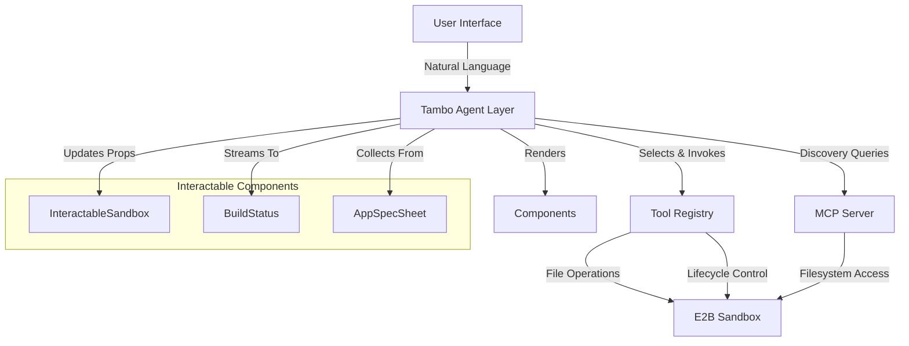

# Design Document: Tambo Generative UI Transformation

## Overview

This design transforms the "Derived" project from an imperative code generator into a declarative Generative UI system. The current architecture treats Tambo as a passive visualization layer, with the core code generation logic isolated in API routes that use brittle XML parsing. The transformation refactors this into an AI-orchestrated system where the Tambo Agent actively controls the interface through structured tool calls and interactable components.

The key architectural shift is from **Imperative-Triggered** to **Declarative-Intent**:

**Current Flow (Imperative):**
```
User Input → Frontend Handler → API Call → Backend Logic → File Write → UI Update
```

**Target Flow (Declarative):**
```
User Input → Tambo Agent → Tool Selection → Tool Execution → UI Generation → Component Render
```

This transformation enables the interface to adapt dynamically to user expertise, provides real-time feedback during long operations, and allows the AI to discover and understand the project structure through MCP, dramatically reducing hallucinations.

## Architecture

### System Components

The transformed system consists of five primary layers:



### Layer Responsibilities

**1. Tambo Agent Layer**
- Analyzes user intent from natural language input
- Selects appropriate tools and components based on context
- Orchestrates multi-step workflows (e.g., scaffold → generate → preview)
- Maintains conversation context and project state awareness
- Adapts UI complexity based on user expertise

**2. Tool Registry**
- `generateCode`: Structured code generation with Zod validation
- `manageSandbox`: E2B lifecycle control (start, stop, restart, install)
- Replaces direct API calls with type-safe, AI-invocable functions
- Provides structured responses for agent decision-making

**3. MCP Server**
- Exposes E2B filesystem through standardized protocol
- Implements `read_file` and `list_files` tools
- Enables AI discovery of project structure
- Reduces hallucinations by providing ground truth

**4. Interactable Components**
- `InteractableSandbox`: Bidirectional preview control (viewport, console, URL)
- `BuildStatus`: Real-time visualization of code generation progress
- `AppSpecSheet`: Adaptive requirement gathering for novice users
- All components expose props to Tambo Agent for state synchronization

**5. E2B Sandbox**
- Secure microVM for code execution
- Vite + React + Tailwind scaffolding
- Isolated from main application via iframe and CSP
- Managed entirely through tools and MCP

### Data Flow Patterns

**Code Generation Flow:**
```
1. User: "Create a login form with email and password"
2. Tambo Agent: Analyzes intent → Selects generateCode tool
3. generateCode Tool: 
   - Validates input schema (Zod)
   - Generates structured file operations
   - Applies to E2B sandbox atomically
   - Returns success/error status
4. Tambo Agent: Receives result → Renders BuildStatus with progress
5. Tambo Agent: Updates InteractableSandbox to show new preview
```

**Discovery Flow:**
```
1. User: "What files are in the project?"
2. Tambo Agent: Invokes MCP list_files tool
3. MCP Server: Queries E2B filesystem → Returns directory tree
4. Tambo Agent: Formats response → Renders as structured list
5. User: "Show me App.jsx"
6. Tambo Agent: Invokes MCP read_file tool → Displays content
```

**Adaptive UI Flow:**
```
1. User (Novice): "I want to build an app"
2. Tambo Agent: Detects vague intent → Renders AppSpecSheet
3. AppSpecSheet: Collects features, design system, complexity
4. User submits form
5. Tambo Agent: Receives structured data → Invokes generateCode
6. ---
7. User (Expert): "Refactor auth middleware to use JWT"
8. Tambo Agent: Detects specific technical intent → Skips AppSpecSheet
9. Tambo Agent: Directly invokes generateCode with targeted changes
```

## Components and Interfaces

### Tool Definitions

#### generateCode Tool

**Purpose:** Replaces the brittle XML-parsing `/api/apply-ai-code` route with a structured, type-safe tool.

**Interface:**
```typescript
interface GenerateCodeInput {
  rationale: string;  // Architectural explanation
  files: Array<{
    path: string;     // e.g., "src/components/LoginForm.tsx"
    content: string;  // Complete file content
    action: 'create' | 'update' | 'delete';
  }>;
  dependencies?: string[];  // e.g., ["react-hook-form", "zod"]
}

interface GenerateCodeOutput {
  success: boolean;
  processedFiles: string[];
  deploymentStatus: string;
  error?: string;
}
```

**Implementation Strategy:**
- Create new API route `/api/apply-ai-code-structured` that accepts JSON
- Validate input with Zod schema before processing
- Process all file operations as atomic transaction
- If any operation fails, rollback entire transaction
- Install dependencies if specified
- Restart Vite dev server after successful application
- Return structured status for agent decision-making

**Error Handling:**
- Zod validation errors → Return 400 with schema violation details
- File write errors → Rollback transaction, return specific file and error
- Dependency installation errors → Return package name and npm error output
- Sandbox connection errors → Return 503 with retry guidance

#### manageSandbox Tool

**Purpose:** Gives Tambo Agent autonomous control over E2B lifecycle.

**Interface:**
```typescript
interface ManageSandboxInput {
  action: 'start' | 'stop' | 'restart' | 'install_deps';
  packages?: string[];  // Required if action is 'install_deps'
}

interface ManageSandboxOutput {
  status: 'active' | 'building' | 'error' | 'stopped';
  sandboxId?: string;
  url?: string;
  error?: string;
}
```

**Implementation Strategy:**
- Map actions to existing API routes:
  - `start` → `/api/create-ai-sandbox`
  - `stop` → `/api/kill-sandbox`
  - `restart` → `/api/restart-vite`
  - `install_deps` → `/api/install-packages`
- Maintain sandbox ID in conversation context
- Return current status after each operation
- Enable self-healing: Agent can detect crash and invoke restart

### Interactable Components

#### InteractableSandbox

**Purpose:** Wraps `SandboxPreview` to enable AI control of preview interface.

**Props Schema:**
```typescript
interface InteractableSandboxProps {
  viewMode: 'desktop' | 'tablet' | 'mobile';
  showConsole: boolean;
  url: string;
  status: 'active' | 'building' | 'error' | 'stopped';
}
```

**Implementation:**
```typescript
import { withInteractable } from '@tambo-ai/react';
import SandboxPreview from '@/components/SandboxPreview';
import { z } from 'zod';

const SandboxStateSchema = z.object({
  viewMode: z.enum(['desktop', 'tablet', 'mobile'])
    .describe('Current viewport configuration'),
  showConsole: z.boolean()
    .describe('Visibility of the terminal overlay'),
  url: z.string()
    .describe('The current route being previewed inside the iframe'),
  status: z.enum(['active', 'building', 'error', 'stopped'])
    .describe('The health status of the sandbox')
});

export const InteractableSandbox = withInteractable(SandboxPreview, {
  componentName: 'SandboxEnvironment',
  description: 'The live preview of the generated application. Supports view switching and console debugging.',
  propsSchema: SandboxStateSchema,
});
```

**Bidirectional State Sync:**
- **Read:** Agent can query current viewMode to understand user context
- **Write:** Agent can update viewMode in response to "show mobile view"
- **Sync:** Props changes trigger React re-render automatically
- **Context:** Agent references state in follow-up ("As you can see in mobile view...")

#### BuildStatus Component

**Purpose:** Visualizes real-time progress during code generation.

**Props Schema:**
```typescript
interface BuildStatusProps {
  steps: Array<{
    id: string;
    label: string;
    status: 'pending' | 'complete' | 'error';
  }>;
  currentStep: string;
  logs: string[];
}
```

**Implementation:**
```typescript
export const BuildStatus = ({ steps, currentStep, logs }: BuildStatusProps) => (
  <div className="p-4 bg-gray-900 rounded-lg font-mono text-sm">
    <div className="space-y-2">
      {steps.map(step => (
        <div key={step.id} className="flex items-center gap-2">
          {step.status === 'pending' && <Spinner className="w-4 h-4" />}
          {step.status === 'complete' && <CheckIcon className="w-4 h-4 text-green-400" />}
          {step.status === 'error' && <XIcon className="w-4 h-4 text-red-400" />}
          <span className={
            step.id === currentStep 
              ? 'text-blue-400 font-semibold' 
              : step.status === 'complete'
              ? 'text-gray-400'
              : 'text-gray-500'
          }>
            {step.label}
          </span>
        </div>
      ))}
    </div>
    <div className="mt-4 h-32 overflow-y-auto bg-black p-2 rounded border border-gray-700">
      {logs.map((log, i) => (
        <div key={i} className="text-gray-300 text-xs">{log}</div>
      ))}
    </div>
  </div>
);
```

**Streaming Integration:**
- `generateCode` tool annotated with streaming support
- Tool yields partial results (log entries) during execution
- Tambo streams updates to BuildStatus component in real-time
- Steps progress from pending → complete as operations finish
- Final result updates all remaining steps and closes stream

#### AppSpecSheet Component

**Purpose:** Adaptive requirement gathering for novice users.

**Props Schema:**
```typescript
interface AppSpecSheetProps {
  features: string[];
  designSystem: 'tailwind' | 'material' | 'chakra' | 'custom';
  complexity: 'simple' | 'moderate' | 'complex';
  onSubmit: (data: AppSpecSheetProps) => void;
}
```

**Implementation:**
```typescript
export const AppSpecSheet = ({ features, designSystem, complexity, onSubmit }: AppSpecSheetProps) => {
  const [formData, setFormData] = useState({ features, designSystem, complexity });
  
  return (
    <div className="p-6 bg-white rounded-lg shadow-lg max-w-2xl">
      <h2 className="text-2xl font-bold mb-4">Let's Build Your App</h2>
      
      <div className="space-y-4">
        <div>
          <label className="block text-sm font-medium mb-2">
            What features do you need?
          </label>
          <textarea
            className="w-full p-2 border rounded"
            placeholder="e.g., User authentication, Dashboard, Data visualization"
            value={formData.features.join(', ')}
            onChange={(e) => setFormData({
              ...formData,
              features: e.target.value.split(',').map(f => f.trim())
            })}
          />
        </div>
        
        <div>
          <label className="block text-sm font-medium mb-2">
            Design System
          </label>
          <select
            className="w-full p-2 border rounded"
            value={formData.designSystem}
            onChange={(e) => setFormData({
              ...formData,
              designSystem: e.target.value as any
            })}
          >
            <option value="tailwind">Tailwind CSS</option>
            <option value="material">Material UI</option>
            <option value="chakra">Chakra UI</option>
            <option value="custom">Custom</option>
          </select>
        </div>
        
        <div>
          <label className="block text-sm font-medium mb-2">
            Complexity Level
          </label>
          <div className="flex gap-4">
            {(['simple', 'moderate', 'complex'] as const).map(level => (
              <button
                key={level}
                className={`px-4 py-2 rounded ${
                  formData.complexity === level
                    ? 'bg-blue-500 text-white'
                    : 'bg-gray-200'
                }`}
                onClick={() => setFormData({ ...formData, complexity: level })}
              >
                {level.charAt(0).toUpperCase() + level.slice(1)}
              </button>
            ))}
          </div>
        </div>
        
        <button
          className="w-full py-3 bg-blue-600 text-white rounded-lg font-semibold hover:bg-blue-700"
          onClick={() => onSubmit(formData)}
        >
          Generate App
        </button>
      </div>
    </div>
  );
};
```

**Adaptive Rendering Logic:**
- Agent analyzes user message for technical specificity
- Vague/beginner prompts → Render AppSpecSheet
- Specific/expert prompts → Skip directly to generateCode
- Agent can transition: Start with form, then switch to direct commands

### MCP Server Implementation

**Purpose:** Provides standardized filesystem access to enable AI discovery.

**Endpoint:** `/api/mcp`

**Transport:** HTTP with Server-Sent Events for streaming

**Tools Exposed:**

1. **read_file**
   - Input: `{ path: string }`
   - Output: `{ content: string, encoding: string }`
   - Reads file from E2B sandbox filesystem

2. **list_files**
   - Input: `{ path: string, recursive?: boolean }`
   - Output: `{ files: Array<{ name: string, type: 'file' | 'directory', size: number }> }`
   - Lists directory contents in E2B sandbox

**Implementation:**
```typescript
// app/api/mcp/route.ts
import { Sandbox } from '@e2b/code-interpreter';
import { NextRequest } from 'next/server';

export async function POST(req: NextRequest) {
  const sandboxId = req.headers.get('x-sandbox-id');
  
  if (!sandboxId) {
    return Response.json(
      { error: 'Missing x-sandbox-id header' },
      { status: 400 }
    );
  }
  
  try {
    const sandbox = await Sandbox.connect(sandboxId);
    const body = await req.json();
    
    switch (body.method) {
      case 'read_file': {
        const content = await sandbox.files.read(body.params.path);
        return Response.json({
          content,
          encoding: 'utf-8'
        });
      }
      
      case 'list_files': {
        const entries = await sandbox.files.list(body.params.path);
        const files = entries.map(entry => ({
          name: entry.name,
          type: entry.type,
          size: entry.size || 0
        }));
        return Response.json({ files });
      }
      
      default:
        return Response.json(
          { error: `Unknown method: ${body.method}` },
          { status: 400 }
        );
    }
  } catch (error) {
    return Response.json(
      { error: error.message },
      { status: 500 }
    );
  }
}
```

**TamboProvider Configuration:**
```typescript
// app/layout.tsx
const mcpServers = [
  {
    name: 'e2b-sandbox',
    url: '/api/mcp',
    headers: {
      'x-sandbox-id': sandboxId  // From context
    }
  }
];

<TamboProvider mcpServers={mcpServers} ...>
  {children}
</TamboProvider>
```

**Discovery Pattern:**
```
1. User: "What's in the project?"
2. Agent: Invokes list_files({ path: '/' })
3. MCP: Returns ['src/', 'public/', 'package.json', ...]
4. Agent: "I see you have a src directory. Let me check what's inside."
5. Agent: Invokes list_files({ path: '/src' })
6. MCP: Returns ['components/', 'App.jsx', 'main.jsx']
7. Agent: Renders structured file tree for user
```

## Data Models

### Sandbox State Model

```typescript
interface SandboxState {
  id: string;
  status: 'active' | 'building' | 'error' | 'stopped';
  url?: string;
  createdAt: Date;
  lastActivity: Date;
  projectStructure?: FileTree;
}

interface FileTree {
  name: string;
  type: 'file' | 'directory';
  children?: FileTree[];
  size?: number;
}
```

**State Management:**
- Maintained in conversation context
- Updated after each tool invocation
- Queried via MCP for ground truth
- Synchronized with InteractableSandbox component

### Code Operation Model

```typescript
interface CodeOperation {
  path: string;
  content: string;
  action: 'create' | 'update' | 'delete';
}

interface CodeTransaction {
  id: string;
  operations: CodeOperation[];
  rationale: string;
  dependencies?: string[];
  status: 'pending' | 'applying' | 'success' | 'rolled_back';
  timestamp: Date;
}
```

**Transaction Lifecycle:**
1. **Pending:** Transaction created, not yet applied
2. **Applying:** Operations being written to filesystem
3. **Success:** All operations completed, changes committed
4. **Rolled_back:** Error occurred, all changes reverted

**Atomicity Guarantee:**
- All operations in transaction succeed or all fail
- Rollback restores filesystem to pre-transaction state
- Implemented via E2B snapshot mechanism or backup copies

### Build Progress Model

```typescript
interface BuildStep {
  id: string;
  label: string;
  status: 'pending' | 'complete' | 'error';
  startTime?: Date;
  endTime?: Date;
  error?: string;
}

interface BuildProgress {
  transactionId: string;
  steps: BuildStep[];
  currentStep: string;
  logs: string[];
  overallStatus: 'in_progress' | 'success' | 'failed';
}
```

**Typical Step Sequence:**
1. Validating input
2. Analyzing project structure
3. Generating code
4. Writing files
5. Installing dependencies
6. Restarting dev server
7. Verifying deployment

### User Expertise Model

```typescript
interface UserExpertise {
  level: 'novice' | 'intermediate' | 'expert';
  indicators: {
    usesJargon: boolean;
    specifiesImplementation: boolean;
    referencesArchitecture: boolean;
  };
  conversationHistory: Message[];
}
```

**Expertise Detection:**
- **Novice:** "I want to make a website"
  - Vague goals, no technical terms
  - → Render AppSpecSheet
  
- **Intermediate:** "Create a React component for user profiles"
  - Specific but high-level
  - → Render simplified code generation flow
  
- **Expert:** "Refactor the auth middleware to use JWT with RS256 signing"
  - Technical specificity, architectural awareness
  - → Direct tool invocation, no hand-holding

## Correctness Properties

*A property is a characteristic or behavior that should hold true across all valid executions of a system—essentially, a formal statement about what the system should do. Properties serve as the bridge between human-readable specifications and machine-verifiable correctness guarantees.*


### Property 1: Tool Output Structure Consistency

*For any* invocation of the generateCode tool with valid input, the returned response SHALL contain the fields: success (boolean), processedFiles (array of strings), deploymentStatus (string), and optionally error (string).

**Validates: Requirements 1.5**

### Property 2: Input Validation Rejection

*For any* invalid input to the generateCode or manageSandbox tools (missing required fields, wrong types, invalid enum values), the system SHALL reject the request with a Zod validation error before any execution occurs.

**Validates: Requirements 1.6**

### Property 3: Transaction Atomicity with Rollback

*For any* code transaction containing multiple file operations where at least one operation fails, the system SHALL roll back all operations, restoring the E2B sandbox filesystem to its exact pre-transaction state, such that no partial changes persist.

**Validates: Requirements 1.7, 12.1, 12.2, 12.3**

### Property 4: Sandbox Action Response Structure

*For any* action (start, stop, restart, install_deps) invoked through the manageSandbox tool, the system SHALL return a response containing a status field with one of the values: active, building, error, or stopped.

**Validates: Requirements 2.4**

### Property 5: Interactable Component State Synchronization

*For any* valid property update to the InteractableSandbox component (viewMode, showConsole, url, or status), the component SHALL re-render with the new property values reflected in the UI within one render cycle.

**Validates: Requirements 3.6**

### Property 6: Build Step Status Progression

*For any* build step that completes successfully during code generation, the step's status SHALL transition from 'pending' to 'complete', and this transition SHALL be reflected in the BuildStatus component.

**Validates: Requirements 4.6**

### Property 7: MCP Filesystem Round-Trip Consistency

*For any* file created in the E2B sandbox with specific content, reading that file through the MCP read_file tool SHALL return content that exactly matches what was written.

**Validates: Requirements 5.2**

### Property 8: MCP Directory Listing Completeness

*For any* directory in the E2B sandbox, invoking the MCP list_files tool SHALL return all files and subdirectories that exist in that directory, with no omissions or duplicates.

**Validates: Requirements 5.3**

### Property 9: Streaming Progress Updates

*For any* execution of the generateCode tool that generates log output, the system SHALL yield log entries progressively during execution, such that logs appear before the final completion status.

**Validates: Requirements 7.1, 7.2**

### Property 10: Streaming Completion Guarantee

*For any* streaming tool execution, the system SHALL always send a final result message with complete operation status, regardless of whether the operation succeeded or failed.

**Validates: Requirements 7.4**

### Property 11: Sequential Operations Within Rate Limits

*For any* sequence of tool invocations that stays within the configured rate limits (10 AI generation, 20 code application, 5 sandbox creation per minute), the system SHALL process all requests without returning 429 status codes.

**Validates: Requirements 8.4**

### Property 12: MCP Sandbox Authorization Validation

*For any* MCP request with a sandbox ID that does not match the authorized instance for the current session, the system SHALL reject the request with an authorization error before attempting any filesystem operations.

**Validates: Requirements 9.6**

### Property 13: Structured Error Reporting

*For any* tool execution failure (generateCode, manageSandbox, MCP operations), the system SHALL return an error response containing a descriptive message field that specifies what failed and why.

**Validates: Requirements 11.1, 11.4, 11.5, 11.7**

### Property 14: Error State Propagation

*For any* E2B sandbox that enters an error state, the InteractableSandbox component's status property SHALL be updated to 'error' and SHALL expose error details accessible to the Tambo Agent.

**Validates: Requirements 11.3**

### Property 15: File Path Validation

*For any* file operation with a path that is invalid (contains '..' traversal, points outside project directory, or uses invalid characters), the system SHALL reject the operation before execution with a path validation error.

**Validates: Requirements 12.4, 12.6**

### Property 16: File Overwrite Protection

*For any* file that already exists in the E2B sandbox, attempting a create operation (action='create') on that path SHALL fail with an error, while an update operation (action='update') SHALL succeed.

**Validates: Requirements 12.5**

### Property 17: Dependency Installation Verification

*For any* valid package name specified in the dependencies array of generateCode, the system SHALL attempt installation and SHALL verify the package exists in node_modules before reporting success.

**Validates: Requirements 13.1, 13.3**

### Property 18: Import Statement Detection

*For any* generated code file containing import statements, the system SHALL parse the imports and SHALL identify the required package names, distinguishing between relative imports (local files) and package imports (node_modules).

**Validates: Requirements 13.2**

### Property 19: Versioned Package Installation

*For any* dependency specified in the format "package@version" (e.g., "react@18.2.0"), the system SHALL install that exact version and SHALL verify the installed version matches the requested version.

**Validates: Requirements 13.5**

### Property 20: Conversation History Persistence

*For any* message sent during a conversation session, the system SHALL store the message in conversation history such that it can be retrieved in subsequent interactions within the same session.

**Validates: Requirements 15.1**

### Property 21: Sandbox State Continuity

*For any* modification made to the E2B sandbox (file creation, dependency installation, configuration change), the modification SHALL persist across multiple conversation turns within the same session, such that querying the sandbox state reflects all previous changes.

**Validates: Requirements 15.2, 15.6**

## Error Handling

### Error Categories

The system implements structured error handling across four categories:

**1. Validation Errors (4xx)**
- **Zod Schema Violations**: Input doesn't match tool schema
- **Path Validation**: Invalid file paths or directory traversal attempts
- **Authorization**: MCP requests with invalid sandbox IDs
- **Rate Limiting**: 429 when request limits exceeded

**2. Execution Errors (5xx)**
- **File Operation Failures**: Permission denied, disk full, invalid encoding
- **Dependency Installation Failures**: Package not found, version conflicts
- **Sandbox Connection Errors**: E2B API unavailable, timeout
- **Transaction Rollback**: Partial operation failure requiring rollback

**3. State Errors**
- **Sandbox Not Ready**: Operations attempted before initialization complete
- **Sandbox Crashed**: Operations attempted on stopped/error sandbox
- **Concurrent Modification**: Multiple operations modifying same file

**4. Streaming Errors**
- **Stream Interruption**: Connection lost during streaming operation
- **Partial Completion**: Operation partially complete when interrupted

### Error Response Format

All errors follow a consistent structure:

```typescript
interface ErrorResponse {
  error: {
    code: string;           // Machine-readable error code
    message: string;        // Human-readable description
    details?: {             // Context-specific details
      field?: string;       // For validation errors
      path?: string;        // For file operation errors
      package?: string;     // For dependency errors
      sandboxId?: string;   // For sandbox errors
    };
    recovery?: {            // Suggested recovery actions
      action: string;       // e.g., "restart_sandbox", "retry"
      params?: any;         // Parameters for recovery action
    };
  };
}
```

### Error Handling Strategies

**Validation Errors:**
- Fail fast before any side effects
- Return detailed schema violation information
- Suggest correct input format

**File Operation Errors:**
- Implement atomic transactions with rollback
- Preserve filesystem state on failure
- Report specific file and operation that failed

**Dependency Errors:**
- Capture full npm error output
- Suggest alternative package versions
- Detect common issues (typos, deprecated packages)

**Sandbox Errors:**
- Expose error state through InteractableSandbox
- Enable agent to invoke recovery actions (restart)
- Maintain error logs for debugging

**Streaming Errors:**
- Report partial completion state
- Allow resumption where possible
- Clean up resources on interruption

### Recovery Mechanisms

**Automatic Recovery:**
- Transaction rollback on file operation failure
- Sandbox restart on crash detection
- Retry with exponential backoff for transient errors

**Agent-Assisted Recovery:**
- Agent detects error state from component props
- Agent suggests recovery actions to user
- Agent invokes manageSandbox tool to restart/repair

**User-Initiated Recovery:**
- Clear error messages guide user action
- Explicit recovery options presented in UI
- Conversation context preserved across recovery

## Testing Strategy

### Dual Testing Approach

The system requires both **unit tests** and **property-based tests** for comprehensive coverage. These approaches are complementary:

**Unit Tests** focus on:
- Specific examples and edge cases
- Integration points between components
- Error conditions with known inputs
- Configuration and setup validation

**Property-Based Tests** focus on:
- Universal properties across all inputs
- Comprehensive input coverage through randomization
- Invariants that must hold for any valid execution
- Round-trip properties and state consistency

### Property-Based Testing Configuration

**Library Selection:**
- **TypeScript/JavaScript**: Use `fast-check` for property-based testing
- Minimum 100 iterations per property test (due to randomization)
- Each test references its design document property

**Test Tagging Format:**
```typescript
// Feature: tambo-generative-ui-transformation, Property 3: Transaction Atomicity with Rollback
test('file operations are atomic with rollback on failure', async () => {
  await fc.assert(
    fc.asyncProperty(
      fc.array(fileOperationArbitrary, { minLength: 2, maxLength: 10 }),
      async (operations) => {
        // Inject failure into one operation
        const failingOps = injectFailure(operations);
        
        // Snapshot filesystem before transaction
        const beforeState = await captureFilesystemState();
        
        // Attempt transaction (should fail)
        const result = await generateCode({ files: failingOps });
        
        // Verify rollback
        const afterState = await captureFilesystemState();
        expect(result.success).toBe(false);
        expect(afterState).toEqual(beforeState);
      }
    ),
    { numRuns: 100 }
  );
});
```

### Unit Test Coverage

**Component Tests:**
- InteractableSandbox renders with all prop combinations
- BuildStatus displays steps and logs correctly
- AppSpecSheet form validation and submission

**Tool Tests:**
- generateCode with valid single-file operation
- generateCode with empty files array (edge case)
- manageSandbox with each action type
- MCP read_file with non-existent file (error case)

**Integration Tests:**
- End-to-end code generation flow
- Sandbox lifecycle from creation to termination
- MCP discovery followed by code modification
- Error recovery through sandbox restart

**Security Tests:**
- CSP enforcement blocks unauthorized frame sources
- Path traversal attempts are blocked
- MCP authorization prevents cross-sandbox access
- Rate limiting triggers at configured thresholds

### Property Test Coverage

Each correctness property maps to a property-based test:

| Property | Test Strategy | Arbitrary Generators |
|----------|---------------|---------------------|
| Property 1: Tool Output Structure | Generate random valid inputs, verify output schema | Valid file operations, rationales, dependencies |
| Property 2: Input Validation | Generate random invalid inputs, verify rejection | Invalid schemas, missing fields, wrong types |
| Property 3: Transaction Atomicity | Generate multi-file operations with injected failures | File operations with controlled failure points |
| Property 7: MCP Round-Trip | Generate random file content, write then read | File paths, content strings with various encodings |
| Property 8: MCP Directory Listing | Generate random directory structures, verify listing | Directory trees with varying depth and file counts |
| Property 15: Path Validation | Generate invalid paths, verify rejection | Paths with traversal, absolute paths, invalid chars |
| Property 18: Import Detection | Generate code with random imports, verify detection | Valid JavaScript/TypeScript with import statements |
| Property 20: Conversation History | Generate random message sequences, verify persistence | User messages, agent responses, timestamps |

### Test Data Generation

**Arbitraries for Property Tests:**

```typescript
// File operation arbitrary
const fileOperationArbitrary = fc.record({
  path: fc.stringMatching(/^src\/[a-z]+\/[A-Z][a-zA-Z]+\.(tsx|ts|jsx|js)$/),
  content: fc.string({ minLength: 10, maxLength: 1000 }),
  action: fc.constantFrom('create', 'update', 'delete')
});

// Invalid path arbitrary (for validation testing)
const invalidPathArbitrary = fc.oneof(
  fc.constant('../../../etc/passwd'),  // Traversal
  fc.constant('/absolute/path'),        // Absolute
  fc.stringMatching(/.*\.\..*/),        // Contains ..
  fc.stringMatching(/.*[<>:"|?*].*/),   // Invalid chars
);

// Package name arbitrary
const packageNameArbitrary = fc.oneof(
  fc.constant('react'),
  fc.constant('lodash'),
  fc.constant('@types/node'),
  fc.stringMatching(/^[a-z][a-z0-9-]*$/)
);

// Versioned package arbitrary
const versionedPackageArbitrary = fc.tuple(
  packageNameArbitrary,
  fc.stringMatching(/^\d+\.\d+\.\d+$/)
).map(([pkg, ver]) => `${pkg}@${ver}`);
```

### Testing Phases

**Phase 1: Component and Tool Unit Tests**
- Test each component in isolation
- Test each tool with known inputs
- Verify error handling for edge cases
- Validate schema definitions

**Phase 2: Property-Based Tests**
- Implement properties 1-21 as property tests
- Run with 100+ iterations each
- Identify edge cases discovered by randomization
- Add specific unit tests for discovered edge cases

**Phase 3: Integration Tests**
- Test complete workflows end-to-end
- Test component and tool interactions
- Test MCP integration with E2B
- Test streaming and real-time updates

**Phase 4: Security and Performance Tests**
- Verify CSP enforcement
- Test rate limiting under load
- Test sandbox isolation
- Test concurrent operations

### Continuous Testing

**Pre-commit Hooks:**
- Run unit tests on changed files
- Run property tests for affected properties
- Verify no TypeScript errors
- Check code formatting

**CI/CD Pipeline:**
- Full unit test suite
- Full property test suite (100 iterations)
- Integration tests with real E2B sandbox
- Security tests
- Performance benchmarks

**Monitoring:**
- Track property test failure rates
- Monitor edge cases discovered by property tests
- Alert on new failure patterns
- Collect metrics on test execution time
